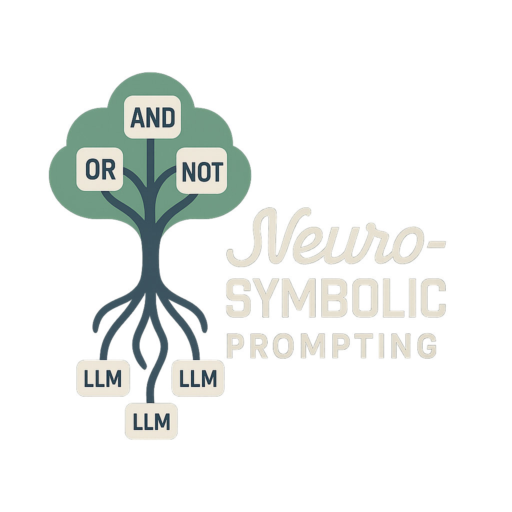

# Neuro-Symbolic Prompting



## Setup
Start by creating a Python virtual environment and installing dependencies:

```bash
make create_environment
source .venv/bin/activate
make requirements
```

Ensure your `python` command points to a Python 3.10+ interpreter.

### Download Datasets
First create the `data/` directory.

#### HWF
Download from
[here](https://drive.google.com/file/d/1VW--BO_CSxzB9C7-ZpE3_hrZbXDqlMU-/view?usp=share_link)
and place under `data/HWF`.

#### CLEVR
Download from [here](https://dl.fbaipublicfiles.com/clevr/CLEVR_v1.0.zip) and
place under `data/CLEVR_v1.0`.

## Running the Main Experiments

The main experiments were conducted using the `scripts/llm_symbolic_eval.py` script. After setting up the environment as described above, you can run the experiments locally. For example, to run the CLEVR few-shot experiment with logging:

```bash
python scripts/llm_symbolic_eval.py \
  --dataset clevr \
  --log \
  --few_shot \
  --model gemini-2.0-flash \
  --image_before \
  --single_turn
```

For a full list of options, see:

```bash
python scripts/llm_symbolic_eval.py --help
```
